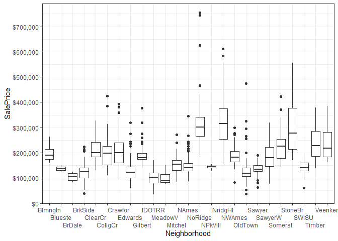

Housing data mini-analysis
================
Alec Wong

``` r
library(dplyr)
library(data.table)
library(readr)
library(purrr)
library(mapsapi)
library(xml2)
library(sf)
library(ggrepel)
library(xgboost)

source("R/load_all_data.R")
source("R/modeling_functions.R")

data = load_data()

# The test dataset has no SalePrice to work with; omit these
data = data %>% filter(train_test == 1)

knitr::opts_chunk$set(comment = NA, 
                      fig.path = 'output/figures/', 
                      fig.width = 10, 
                      fig.height = 5, 
                      dpi = 300, 
                      dev.args = list(type = "cairo"))
```

# Housing data

The data are sourced from the Kaggle competition found here:
<https://www.kaggle.com/c/house-prices-advanced-regression-techniques>

I used the Kaggle API to download the data:

    kaggle competitions download -c house-prices-advanced-regression-techniques

The `data_description.txt` file contains all the relevant metadata on
the dataset.

Among the many variables included in the dataset here, the
`Neighborhoods` variable caught my eye. It was clear from the
`data_description.txt` file that the neighborhoods were located in Ames,
Iowa. The objective of this short exploration became:

  - Geocode the neighborhoods.
  - See if including the neighborhood spatial information improves
    prediction.

## Neighborhood values

The neighborhood values take on the following, as described in the
`data_description.txt` file. It was tab-delimited already within the
text file, so I extracted it into its own `.tsv` file.

``` r
neighborhoods = readr::read_delim(file = 'data/neighborhoods_match.tsv', 
                                  delim = '\t', 
                                  col_names = c("abbreviation", "neighborhood"),
                                  col_types = cols(col_character(), col_character())
)

neighborhoods %>% print(n = 100)
```

``` 
# A tibble: 25 x 2
   abbreviation neighborhood                         
   <chr>        <chr>                                
 1 Blmngtn      Bloomington Heights                  
 2 Blueste      Bluestem                             
 3 BrDale       Briardale                            
 4 BrkSide      Brookside                            
 5 ClearCr      Clear Creek                          
 6 CollgCr      College Creek                        
 7 Crawfor      Crawford                             
 8 Edwards      Edwards                              
 9 Gilbert      Gilbert                              
10 IDOTRR       Iowa DOT and Rail Road               
11 MeadowV      Meadow Village                       
12 Mitchel      Mitchell                             
13 Names        North Ames                           
14 NoRidge      Northridge                           
15 NPkVill      Northpark Villa                      
16 NridgHt      Northridge Heights                   
17 NWAmes       Northwest Ames                       
18 OldTown      Old Town                             
19 SWISU        South & West of Iowa State University
20 Sawyer       Sawyer                               
21 SawyerW      Sawyer West                          
22 Somerst      Somerset                             
23 StoneBr      Stone Brook                          
24 Timber       Timberland                           
25 Veenker      Veenker                              
```

There are 25 neighborhoods, and after entering some of these by hand,
most of these have some definition using the [Google Maps Geocoding
API](https://developers.google.com/maps/documentation/geocoding/intro).

The neighborhoods have some moderate correlation with housing cost, and
intuitively one would assume that neighborhoods closer together might
covary more than neighborhoods farther apart.

``` r
data %>% 
  ggplot() + 
  geom_boxplot(aes(x = Neighborhood, y = SalePrice)) + 
  theme_bw() + 
  scale_x_discrete(guide = guide_axis(n.dodge = 3)) + 
  scale_y_continuous(labels = scales::dollar, breaks = seq(0, 1e6, by = 1e5))
```

<!-- -->

While I noticed this later on, one of the neighborhood values actually
doesn’t align with the description data *exactly*; the casing is
different:

``` r
setdiff(data$Neighborhood, neighborhoods$abbreviation)
```

    [1] "NAmes"

``` r
setdiff(neighborhoods$abbreviation, data$Neighborhood)
```

    [1] "Names"

Of course the name is artificial anyway, but for matching purposes later
on, I just `tolower` all the neighborhood references.

``` r
neighborhoods$abbreviation = tolower(neighborhoods$abbreviation)
data$Neighborhood = tolower(data$Neighborhood)
```

Additionally, two of the neighborhood locations don’t have any suitable
geocoded location from Google Maps, which puts them in Seattle; these
are the `swisu`, or `South & West of Iowa State University`, and
`npkvill`, or `Northpark Villa` locations. The first, `swisu`, I impute
instead simply Iowa State University as a stop-gap, since “south and
west” of it isn’t much more informative.

## Geocoding the neighborhoods

I make use of Google’s Geocode API and the corresponding package
`mapsapi` to interface with it through R.

``` r
api_key = Sys.getenv("gmaps_api_key")
```

    ames, iowa..............................OK

-----

``` r
sessionInfo()
```

``` 
R version 3.6.3 (2020-02-29)
Platform: x86_64-w64-mingw32/x64 (64-bit)
Running under: Windows 10 x64 (build 18363)

Matrix products: default

locale:
[1] LC_COLLATE=English_United States.1252 
[2] LC_CTYPE=English_United States.1252   
[3] LC_MONETARY=English_United States.1252
[4] LC_NUMERIC=C                          
[5] LC_TIME=English_United States.1252    

attached base packages:
[1] stats     graphics  grDevices utils     datasets  methods   base     

other attached packages:
 [1] xgboost_1.0.0.2   ggrepel_0.8.2     ggplot2_3.3.0     sf_0.9-2         
 [5] xml2_1.3.1        mapsapi_0.4.5     purrr_0.3.3       readr_1.3.1      
 [9] data.table_1.12.8 dplyr_0.8.5      

loaded via a namespace (and not attached):
 [1] Rcpp_1.0.3         pillar_1.4.3       compiler_3.6.3     bitops_1.0-6      
 [5] class_7.3-15       tools_3.6.3        digest_0.6.25      lattice_0.20-38   
 [9] gtable_0.3.0       evaluate_0.14      lifecycle_0.2.0    tibble_3.0.0      
[13] pkgconfig_2.0.3    rlang_0.4.5        Matrix_1.2-18      cli_2.0.2         
[17] DBI_1.1.0          curl_4.3           yaml_2.2.1         xfun_0.12         
[21] e1071_1.7-3        withr_2.1.2        stringr_1.4.0      knitr_1.28        
[25] vctrs_0.2.4        hms_0.5.3          classInt_0.4-3     grid_3.6.3        
[29] tidyselect_1.0.0   glue_1.3.2         R6_2.4.1           fansi_0.4.1       
[33] rmarkdown_2.1      farver_2.0.3       magrittr_1.5       scales_1.1.0      
[37] units_0.6-6        ellipsis_0.3.0     htmltools_0.4.0    assertthat_0.2.1  
[41] colorspace_1.4-1   utf8_1.1.4         KernSmooth_2.23-16 stringi_1.4.6     
[45] munsell_0.5.0      crayon_1.3.4      
```
