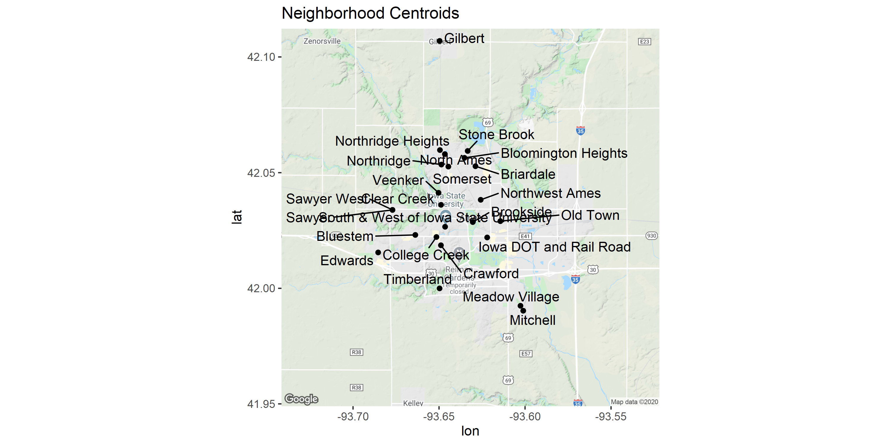

Housing data mini-analysis
================
Alec Wong

``` r
library(dplyr)
library(data.table)
library(readr)
library(purrr)
library(mapsapi)
library(xml2)
library(sf)
library(ggrepel)
library(xgboost)
library(ggmap)
library(memoise)

source("R/load_all_data.R")

data = load_data()

# The test dataset has no SalePrice to work with; omit these
data = data %>% filter(train_test == 1)

knitr::opts_chunk$set(comment = NA,
                      fig.path = 'output/figures/',
                      fig.width = 10,
                      fig.height = 5,
                      dpi = 300,
                      dev.args = list(type = "cairo"))
```

# Housing data

The data are sourced from the Kaggle competition found here:
<https://www.kaggle.com/c/house-prices-advanced-regression-techniques>

I used the Kaggle API to download the data:

    kaggle competitions download -c house-prices-advanced-regression-techniques

The `data_description.txt` file contains all the relevant metadata on
the dataset.

Among the many variables included in the dataset here, the
`Neighborhoods` variable caught my eye. It was clear from the
`data_description.txt` file that the neighborhoods were located in Ames,
Iowa. The objective of this short exploration became:

  - Geocode the neighborhoods.
  - See if including the neighborhood spatial information improves
    prediction.

## Neighborhood values

The neighborhood values take on the following, as described in the
`data_description.txt` file. It was tab-delimited already within the
text file, so I extracted it into its own `.tsv` file.

``` r
neighborhoods = readr::read_delim(file = 'data/neighborhoods_match.tsv',
                                  delim = '\t',
                                  col_names = c("abbreviation", "neighborhood"),
                                  col_types = cols(col_character(), col_character())
)

neighborhoods %>% print(n = 100)
```

``` 
# A tibble: 25 x 2
   abbreviation neighborhood                         
   <chr>        <chr>                                
 1 Blmngtn      Bloomington Heights                  
 2 Blueste      Bluestem                             
 3 BrDale       Briardale                            
 4 BrkSide      Brookside                            
 5 ClearCr      Clear Creek                          
 6 CollgCr      College Creek                        
 7 Crawfor      Crawford                             
 8 Edwards      Edwards                              
 9 Gilbert      Gilbert                              
10 IDOTRR       Iowa DOT and Rail Road               
11 MeadowV      Meadow Village                       
12 Mitchel      Mitchell                             
13 Names        North Ames                           
14 NoRidge      Northridge                           
15 NPkVill      Northpark Villa                      
16 NridgHt      Northridge Heights                   
17 NWAmes       Northwest Ames                       
18 OldTown      Old Town                             
19 SWISU        South & West of Iowa State University
20 Sawyer       Sawyer                               
21 SawyerW      Sawyer West                          
22 Somerst      Somerset                             
23 StoneBr      Stone Brook                          
24 Timber       Timberland                           
25 Veenker      Veenker                              
```

There are 25 neighborhoods, and after entering some of these by hand,
most of these have some definition using the [Google Maps Geocoding
API](https://developers.google.com/maps/documentation/geocoding/intro).

The neighborhoods have some moderate correlation with housing cost, and
intuitively one would assume that neighborhoods closer together might
covary more than neighborhoods farther apart.

``` r
data %>%
  ggplot() +
  geom_boxplot(aes(x = Neighborhood, y = SalePrice)) +
  theme_bw() +
  scale_x_discrete(guide = guide_axis(n.dodge = 3)) +
  scale_y_continuous(labels = scales::dollar, breaks = seq(0, 1e6, by = 1e5))
```

<!-- -->

While I noticed this later on, one of the neighborhood values actually
doesn’t align with the description data *exactly*; the casing is
different:

``` r
setdiff(data$Neighborhood, neighborhoods$abbreviation)
```

    [1] "NAmes"

``` r
setdiff(neighborhoods$abbreviation, data$Neighborhood)
```

    [1] "Names"

Of course the name is artificial anyway, but for matching purposes later
on, I just `tolower` all the neighborhood references.

``` r
neighborhoods$abbreviation = tolower(neighborhoods$abbreviation)
data$Neighborhood = tolower(data$Neighborhood)
```

Additionally, two of the neighborhood locations don’t have any suitable
geocoded location from Google Maps, which puts them in Seattle; these
are the `swisu`, or `South & West of Iowa State University`, and
`npkvill`, or `Northpark Villa` locations. The first, `swisu`, I impute
instead simply Iowa State University as a stop-gap, since “south and
west” of it isn’t much more informative. The `Northpark Villa` is more
of an anomaly, as searching “Northpark” in Google Maps doesn’t turn
anything up in the relatively small town of Ames. I end up omitting
these records for this exercise.

## Testing out the Geocoding API

I make use of Google’s Geocode API and the corresponding package
`mapsapi` to interface with it through R.

``` r
api_key = Sys.getenv("gmaps_api_key")
```

I can obtain a bounding box for Ames, Iowa, and with `ggmap`, plot it.
Before I do, I want to memoise the `mp_geocode` function, which stores
the results in cache in memory and accesses those saved values for any
function calls with duplicate arguments. This will avoid unnecessary
calls to the API as I develop.

``` r
mm_mp_geocode = memoise::memoise(f = function(address, key){mp_geocode(address, key = api_key)})
```

What returns is essentially an XML response with some metadata and
location information, as well as return status.

``` r
ames_bb = mm_mp_geocode("ames, iowa", key = api_key)
```

    ames, iowa..............................OK

``` r
ames_bb
```

    $`ames, iowa`
    {xml_document}
    <GeocodeResponse>
    [1] <status>OK</status>
    [2] <result>\n  <type>locality</type>\n  <type>political</type>\n  <formatted ...

`mapsapi` interacts with this XML response directly, and we can get
points, polygons, and boundaries from the response.

``` r
ames_poly = mp_get_bounds(ames_bb)
ames_pt   = mp_get_points(ames_bb)
ggmap::register_google(key = api_key)
ames_ia_map = suppressMessages(ggmap::get_map(location = sf::st_coordinates(ames_pt), zoom = 12, source = 'google', messaging = FALSE))

ggmap(ggmap = ames_ia_map) +
  geom_polygon(data = ames_poly %>% st_coordinates() %>% as.data.frame, aes(x = X, y = Y),
               fill = NA, color = 'red4')
```

<!-- -->

Great.

## Geocoding the neighborhoods

To input the neighborhoods into the Geocoding API, I can’t just give it
the names; I will need to give “Ames, Iowa” as context so that it
doesn’t get data from just any location. I make a new column in the
`neighborhoods` data to search with, by appending “Ames, Iowa” to the
neighborhood name. Also, as mentioned before, `swisu` and `npkvill`
don’t really have good matches, so I modify those appropriately.

``` r
# the search column will be use for the 'address' argument in mp_geocode
neighborhoods$search = stringr::str_c(neighborhoods$neighborhood, ", Ames Iowa")

# `South and West of Iowa State University` is no good, so I impute just the university name
neighborhoods = neighborhoods %>%
  mutate(search = case_when(
    abbreviation == 'swisu' ~ "Iowa State University",
    TRUE ~ search
  )) %>%
  filter(abbreviation != "npkvill")

neighborhoods$search
```

``` 
 [1] "Bloomington Heights, Ames Iowa"    "Bluestem, Ames Iowa"              
 [3] "Briardale, Ames Iowa"              "Brookside, Ames Iowa"             
 [5] "Clear Creek, Ames Iowa"            "College Creek, Ames Iowa"         
 [7] "Crawford, Ames Iowa"               "Edwards, Ames Iowa"               
 [9] "Gilbert, Ames Iowa"                "Iowa DOT and Rail Road, Ames Iowa"
[11] "Meadow Village, Ames Iowa"         "Mitchell, Ames Iowa"              
[13] "North Ames, Ames Iowa"             "Northridge, Ames Iowa"            
[15] "Northridge Heights, Ames Iowa"     "Northwest Ames, Ames Iowa"        
[17] "Old Town, Ames Iowa"               "Iowa State University"            
[19] "Sawyer, Ames Iowa"                 "Sawyer West, Ames Iowa"           
[21] "Somerset, Ames Iowa"               "Stone Brook, Ames Iowa"           
[23] "Timberland, Ames Iowa"             "Veenker, Ames Iowa"               
```

I’m ready to plug each of these addresses into the `mp_geocode`
function, or rather our memoised version of it.

``` r
neigh_geocode = neighborhoods$search %>% map(.f = ~mm_mp_geocode(address = .x, key = api_key))
```

    Bloomington Heights, Ames Iowa..........OK
    Bluestem, Ames Iowa.....................OK
    Briardale, Ames Iowa....................OK
    Brookside, Ames Iowa....................OK
    Clear Creek, Ames Iowa..................OK
    College Creek, Ames Iowa................OK
    Crawford, Ames Iowa.....................OK
    Edwards, Ames Iowa......................OK
    Gilbert, Ames Iowa......................OK
    Iowa DOT and Rail Road, Ames Iowa.......OK
    Meadow Village, Ames Iowa...............OK
    Mitchell, Ames Iowa.....................OK
    North Ames, Ames Iowa...................OK
    Northridge, Ames Iowa...................OK
    Northridge Heights, Ames Iowa...........OK
    Northwest Ames, Ames Iowa...............OK
    Old Town, Ames Iowa.....................OK
    Iowa State University...................OK
    Sawyer, Ames Iowa.......................OK
    Sawyer West, Ames Iowa..................OK
    Somerset, Ames Iowa.....................OK
    Stone Brook, Ames Iowa..................OK
    Timberland, Ames Iowa...................OK
    Veenker, Ames Iowa......................OK

First I tried to get the bounding boxes of each neighborhood to see the
result:

``` r
neigh_bb = neigh_geocode %>% map(.f = ~try(mp_get_bounds(.x)))
```

    Warning in data.frame(..., check.names = FALSE): row names were found from a
    short variable and have been discarded

    Error in getClassDim(x, length(x), dim, "POINT") : 
      0 is an illegal number of columns for a POINT
    Error in getClassDim(x, length(x), dim, "POINT") : 
      0 is an illegal number of columns for a POINT
    Error in getClassDim(x, length(x), dim, "POINT") : 
      0 is an illegal number of columns for a POINT
    Error in getClassDim(x, length(x), dim, "POINT") : 
      0 is an illegal number of columns for a POINT
    Error in getClassDim(x, length(x), dim, "POINT") : 
      0 is an illegal number of columns for a POINT
    Error in getClassDim(x, length(x), dim, "POINT") : 
      0 is an illegal number of columns for a POINT
    Error in getClassDim(x, length(x), dim, "POINT") : 
      0 is an illegal number of columns for a POINT
    Error in getClassDim(x, length(x), dim, "POINT") : 
      0 is an illegal number of columns for a POINT
    Error in getClassDim(x, length(x), dim, "POINT") : 
      0 is an illegal number of columns for a POINT
    Error in getClassDim(x, length(x), dim, "POINT") : 
      0 is an illegal number of columns for a POINT
    Error in getClassDim(x, length(x), dim, "POINT") : 
      0 is an illegal number of columns for a POINT
    Error in getClassDim(x, length(x), dim, "POINT") : 
      0 is an illegal number of columns for a POINT
    Error in getClassDim(x, length(x), dim, "POINT") : 
      0 is an illegal number of columns for a POINT
    Error in getClassDim(x, length(x), dim, "POINT") : 
      0 is an illegal number of columns for a POINT
    Error in getClassDim(x, length(x), dim, "POINT") : 
      0 is an illegal number of columns for a POINT

    Warning in data.frame(..., check.names = FALSE): row names were found from a
    short variable and have been discarded

    Error in getClassDim(x, length(x), dim, "POINT") : 
      0 is an illegal number of columns for a POINT

Clearly there were a number of errors; some of the types returned were
points, having no bounding box. Already not too good of a start. What
have we got?

``` r
# Subset out the errors
neigh_bb_errors = neigh_bb %>% map_lgl(.f = ~inherits(.x, "try-error"))
neigh_bb = neigh_bb[!neigh_bb_errors]

# Print a sample
neigh_bb[[1]]
```

    Simple feature collection with 2 features and 3 fields
    geometry type:  POLYGON
    dimension:      XYZM
    bbox:           xmin: -93.64965 ymin: -93.64965 xmax: -93.6202 ymax: -93.63951
    z_range:        zmin: 42.05494 zmax: 42.05821
    m_range:        mmin: 42.05576 mmax: 42.05699
    CRS:            EPSG:4326
      status                        address                      address_google
    1     OK Bloomington Heights, Ames Iowa Bloomington Rd, Ames, IA 50010, USA
    2     OK Bloomington Heights, Ames Iowa Bloomington Rd, Ames, IA 50010, USA
                            geometry
    1 POLYGON ZM ((-93.64965 -93....
    2 POLYGON ZM ((-93.64965 -93....

We’re using the `sf` package for the “Simple Features” geometries, using
[well-known
text](https://en.wikipedia.org/wiki/Well-known_text_representation_of_geometry)
values.

``` r
# Get the neighborhood bounding box points for mapping
n_points = map2(.x = neigh_bb,
                .y = neighborhoods$neighborhood[!neigh_bb_errors],
                .f = ~sf::st_coordinates(.x) %>% as.data.frame %>% cbind(.y, .)
                )

ggmap(ames_ia_map) +
  map(.x = n_points, .f = ~geom_polygon(data = .x, aes(x = X, y = Y), fill = NA, color = 'red4')) +
  map(.x = n_points, .f = ~geom_text(data = .x , aes(x = mean(X), y = mean(Y), label = .y)))
```

<!-- -->

Evidently polygon definitions for the neighborhoods isn’t as easily
obtained, so I resort to using centroids to define the spatial
information.

``` r
# Get the centroid points
neigh_centroids = map(.x = neigh_geocode, .f = ~.x %>% mp_get_points())
# Combine these simple features into a data.frame
neigh_cent_df  = neigh_centroids %>% do.call(what = rbind, args = .)
# Add the coordinates themselves to the data frame
neigh_cent_df = cbind(neigh_cent_df, st_coordinates(neigh_cent_df))
# Join this with our neighborhoods table
neighborhoods$geometry = neigh_cent_df$pnt
coords = st_coordinates(neigh_cent_df)
neighborhoods$X = coords[,1]
neighborhoods$Y = coords[,2]

neighborhoods %>% select(neighborhood, geometry, X, Y)
```

    # A tibble: 24 x 4
       neighborhood                       geometry     X     Y
       <chr>                           <POINT [°]> <dbl> <dbl>
     1 Bloomington Heights    (-93.63524 42.05642) -93.6  42.1
     2 Bluestem               (-93.66378 42.02309) -93.7  42.0
     3 Briardale               (-93.62882 42.0528) -93.6  42.1
     4 Brookside              (-93.63039 42.02865) -93.6  42.0
     5 Clear Creek             (-93.64883 42.0361) -93.6  42.0
     6 College Creek           (-93.65151 42.0222) -93.7  42.0
     7 Crawford                (-93.6489 42.01861) -93.6  42.0
     8 Edwards                (-93.68539 42.01551) -93.7  42.0
     9 Gilbert                (-93.64966 42.10693) -93.6  42.1
    10 Iowa DOT and Rail Road   (-93.62202 42.022) -93.6  42.0
    # ... with 14 more rows

``` r
ggmap(ames_ia_map) +
  geom_point(data = neighborhoods, aes(x = X, y = Y)) +
  geom_text_repel(data = neighborhoods, aes(x = X, y = Y, label = neighborhood)) +
  ggtitle("Neighborhood Centroids")
```

<!-- -->

Having the centroids, integrate this with the data:

``` r
# Set to UTM
neighborhoods = neighborhoods %>%
  mutate(geometry_utm = sf::st_transform(geometry, 32615),
         easting  = sf::st_coordinates(geometry_utm)[,1],
         northing = sf::st_coordinates(geometry_utm)[,2])

data$neigh_centroid = neighborhoods$geometry_utm[match(x = data$Neighborhood, neighborhoods$abbreviation)]
data = data[!sf::st_is_empty(data$neigh_centroid), ]
coords = data$neigh_centroid %>% st_coordinates()

data$easting = coords[,1]
data$northing = coords[,2]
```

## Models

### Modeling using neighborhood centroids

The question I had was; does modeling the neighborhoods as continuous
location variables improve prediction performance?

I split the data into training and test sets, and remove the
Neighborhood names themselves

``` r
train_test = sample(c(1,2), size = nrow(data), replace = TRUE, prob = c(0.75, 0.25))
data$train_test = train_test

train_data = data %>%
  filter(train_test == 1) %>%
  select(-Neighborhood, -neigh_centroid, -Id, -train_test, -Utilities, -PoolQC) %>%
  modify_if(.p = ~is.character(.x), .f = ~factor(.x))

test_data = data %>%
  filter(train_test == 2)  %>%
  select(-Neighborhood, -neigh_centroid, -Id, -train_test, -Utilities, -PoolQC)%>%
  modify_if(.p = ~is.character(.x), .f = ~factor(.x))

options(na.action = na.pass)
mm_data = model.matrix(SalePrice~ -1 + ., data = data %>%
                         select(-Neighborhood, -neigh_centroid, -Id, -train_test, -Utilities, -PoolQC))
mm_train = mm_data[data$train_test == 1,]
mm_test  = mm_data[data$train_test == 2,]

# Taken from a different kaggle kernel
default_param = list(
        objective = "reg:linear",
        booster = "gbtree",
        eta=0.05, #default = 0.3
        gamma=0,
        max_depth=3, #default=6
        min_child_weight=4, #default=1
        subsample=1,
        colsample_bytree=1
)
```

XGboost takes a matrix covariate input, so I use `model.matrix` to
format the input properly.

``` r
xgb = xgboost(data = mm_train, label = train_data$SalePrice, nrounds = 500, params = default_param,
              verbose = 0)
```

``` r
xgb
```

    ##### xgb.Booster
    raw: 304.4 Kb 
    call:
      xgb.train(params = params, data = dtrain, nrounds = nrounds, 
        watchlist = watchlist, verbose = verbose, print_every_n = print_every_n, 
        early_stopping_rounds = early_stopping_rounds, maximize = maximize, 
        save_period = save_period, save_name = save_name, xgb_model = xgb_model, 
        callbacks = callbacks)
    params (as set within xgb.train):
      objective = "reg:linear", booster = "gbtree", eta = "0.05", gamma = "0", max_depth = "3", min_child_weight = "4", subsample = "1", colsample_bytree = "1", silent = "1"
    xgb.attributes:
      niter
    callbacks:
      cb.evaluation.log()
    # of features: 221 
    niter: 500
    nfeatures : 221 
    evaluation_log:
        iter train_rmse
           1  189978.33
           2  181088.41
    ---                
         499   10075.42
         500   10058.74

Additionally, run cross-validation to assess out-of-sample measurement
error.

``` r
cv_locs = xgb.cv(data = mm_train, label = train_data$SalePrice, nrounds = 500, early_stopping_rounds = 10,
       params = default_param, nfold = 10, metrics = 'rmse')
```

``` r
cv_locs
```

    ##### xgb.cv 10-folds
        iter train_rmse_mean train_rmse_std test_rmse_mean test_rmse_std
           1       189984.35      1342.7440      189875.09     12316.111
           2       181090.77      1305.0900      181030.97     12114.884
           3       172648.02      1261.9029      172585.79     11964.822
           4       164634.43      1224.2690      164601.39     11713.839
           5       157020.76      1184.4157      157019.30     11614.956
    ---                                                                 
         253        12896.79       345.5219       29112.96      9655.741
         254        12875.06       351.5855       29125.90      9658.919
         255        12857.48       350.4368       29122.11      9664.666
         256        12840.56       356.6583       29125.77      9665.473
         257        12817.27       351.2105       29112.06      9671.807
    Best iteration:
     iter train_rmse_mean train_rmse_std test_rmse_mean test_rmse_std
      247        13021.81       353.2953       29108.83      9639.134

Out-of-sample test error:

``` r
prediction = predict(xgb, mm_train)
resid = prediction - train_data$SalePrice
train_data$resid = resid
predict_test = predict(xgb, mm_test)
resid_test = predict_test - test_data$SalePrice
test_data$resid = resid_test
# RMSE
rmse = mean(sqrt(resid_test^2))

plot(resid_test)
points(resid, col = 'red')
title(main = paste0("RMSE: ", scales::dollar(rmse)))
```

<!-- -->

### Modeling with neighborhoods as factors

Now, compare with using the neighborhood names as straight factors:

``` r
# Does Neighborhood make a more informative prediction?
train_data_fac = data %>%
  filter(train_test == 1) %>%
  select(-easting, -northing, -neigh_centroid, -Id, -train_test, -Utilities, -PoolQC) %>%
  modify_if(.p = ~is.character(.x), .f = ~factor(.x))

test_data_fac = data %>%
  filter(train_test == 2)  %>%
  select(-easting, -northing, -neigh_centroid, -Id, -train_test, -Utilities, -PoolQC)%>%
  modify_if(.p = ~is.character(.x), .f = ~factor(.x))

mm_data = model.matrix(SalePrice~ -1 + ., data = data %>%
                         select(-easting, -northing, -neigh_centroid, -Id, -train_test, -Utilities, -PoolQC))
mm_train = mm_data[data$train_test == 1,]
mm_test  = mm_data[data$train_test == 2,]
```

``` r
xgb_fac = xgboost(data = mm_train, label = train_data_fac$SalePrice, nrounds = 500, 
                  verbose = 0, params = default_param)
```

``` r
xgb_fac
```

    ##### xgb.Booster
    raw: 302.9 Kb 
    call:
      xgb.train(params = params, data = dtrain, nrounds = nrounds, 
        watchlist = watchlist, verbose = verbose, print_every_n = print_every_n, 
        early_stopping_rounds = early_stopping_rounds, maximize = maximize, 
        save_period = save_period, save_name = save_name, xgb_model = xgb_model, 
        callbacks = callbacks)
    params (as set within xgb.train):
      objective = "reg:linear", booster = "gbtree", eta = "0.05", gamma = "0", max_depth = "3", min_child_weight = "4", subsample = "1", colsample_bytree = "1", silent = "1"
    xgb.attributes:
      niter
    callbacks:
      cb.evaluation.log()
    # of features: 242 
    niter: 500
    nfeatures : 242 
    evaluation_log:
        iter train_rmse
           1 189989.953
           2 181110.875
    ---                
         499  10006.789
         500   9994.486

``` r
cv_fac = xgb.cv(data = mm_train, label = train_data_fac$SalePrice, nrounds = 500, early_stopping_rounds = 10,
       params = default_param, nfold = 10, metrics = 'rmse')
```

``` r
cv_fac
```

    ##### xgb.cv 10-folds
        iter train_rmse_mean train_rmse_std test_rmse_mean test_rmse_std
           1       189993.10       628.9467      189862.03      5566.344
           2       181112.33       612.1326      181061.00      5411.613
           3       172682.97       596.0756      172717.14      5299.626
           4       164670.80       577.4218      164796.35      5256.220
           5       157069.31       557.8738      157270.61      5081.309
    ---                                                                 
         324        11743.67       201.2123       28978.45      7785.230
         325        11730.42       200.3219       28977.46      7786.013
         326        11713.72       204.7482       28976.02      7781.878
         327        11698.44       204.0752       28971.19      7777.175
         328        11683.55       200.5098       28964.06      7767.884
    Best iteration:
     iter train_rmse_mean train_rmse_std test_rmse_mean test_rmse_std
      318        11849.18       198.2615       28959.08      7769.454

Out-of-sample test error:

``` r
prediction = predict(xgb_fac, mm_train)
resid = prediction - train_data_fac$SalePrice
train_data_fac$resid_fac = resid

predict_test = predict(xgb_fac, mm_test)
resid_test = predict_test - test_data_fac$SalePrice
test_data_fac$resid_test = resid_test
# RMSE
rmse = mean(sqrt(resid_test^2))

plot(resid_test)
points(resid, col = 'red')
title(main = paste0("RMSE: ", scales::dollar(rmse)))
```

<!-- -->

# Conclusion

This turned out to be mostly an exercise in geocoding and formatting
spatial data; it doesn’t appear that geocoding the locations actually
reduces prediction error by a large margin, in fact sometimes it
degrades it.

-----

``` r
sessionInfo()
```

``` 
R version 3.6.3 (2020-02-29)
Platform: x86_64-w64-mingw32/x64 (64-bit)
Running under: Windows 10 x64 (build 18363)

Matrix products: default

locale:
[1] LC_COLLATE=English_United States.1252 
[2] LC_CTYPE=English_United States.1252   
[3] LC_MONETARY=English_United States.1252
[4] LC_NUMERIC=C                          
[5] LC_TIME=English_United States.1252    

attached base packages:
[1] stats     graphics  grDevices utils     datasets  methods   base     

other attached packages:
 [1] memoise_1.1.0     ggmap_3.0.0       xgboost_1.0.0.2   ggrepel_0.8.2    
 [5] ggplot2_3.3.0     sf_0.9-2          xml2_1.3.1        mapsapi_0.4.5    
 [9] purrr_0.3.3       readr_1.3.1       data.table_1.12.8 dplyr_0.8.5      

loaded via a namespace (and not attached):
 [1] tidyselect_1.0.0    xfun_0.12           lattice_0.20-38    
 [4] colorspace_1.4-1    vctrs_0.2.4         htmltools_0.4.0    
 [7] yaml_2.2.1          utf8_1.1.4          rlang_0.4.5        
[10] e1071_1.7-3         pillar_1.4.3        glue_1.3.2         
[13] withr_2.1.2         DBI_1.1.0           sp_1.4-1           
[16] plyr_1.8.6          jpeg_0.1-8.1        lifecycle_0.2.0    
[19] stringr_1.4.0       munsell_0.5.0       gtable_0.3.0       
[22] RgoogleMaps_1.4.5.3 codetools_0.2-16    evaluate_0.14      
[25] labeling_0.3        knitr_1.28          curl_4.3           
[28] class_7.3-15        fansi_0.4.1         Rcpp_1.0.3         
[31] KernSmooth_2.23-16  scales_1.1.0        classInt_0.4-3     
[34] farver_2.0.3        rjson_0.2.20        hms_0.5.3          
[37] png_0.1-7           digest_0.6.25       stringi_1.4.6      
[40] grid_3.6.3          cli_2.0.2           tools_3.6.3        
[43] bitops_1.0-6        magrittr_1.5        tibble_3.0.0       
[46] tidyr_1.0.2         crayon_1.3.4        pkgconfig_2.0.3    
[49] ellipsis_0.3.0      Matrix_1.2-18       assertthat_0.2.1   
[52] rmarkdown_2.1       httr_1.4.1          R6_2.4.1           
[55] units_0.6-6         compiler_3.6.3     
```
