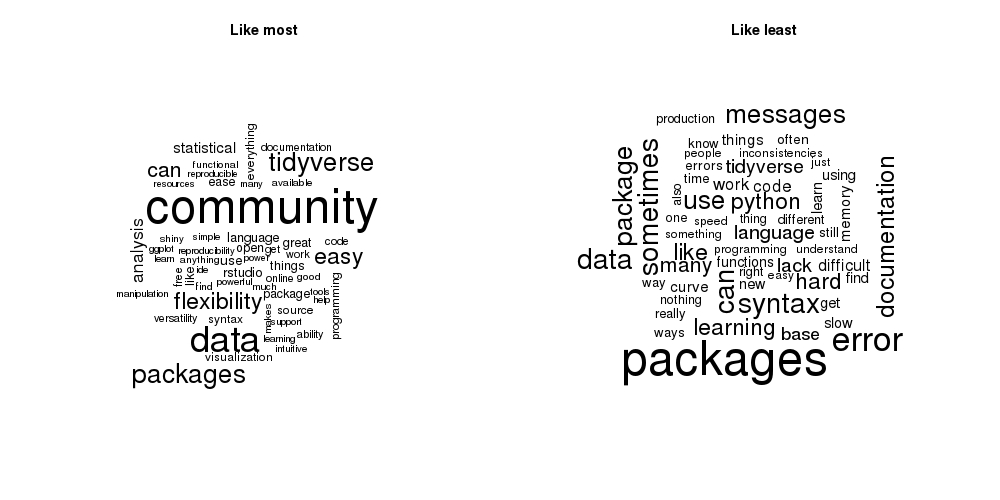

# A silly word cloud example

```{r}
# Quick and simple word cloud example using R survey data
# For the April, 2020 Cleveland R user group meetup.

library(data.table)  # used only for its fast data reader here
library(wordcloud)   # used to plot word clouds
library(tm)          # used to remove punctuation and common words from text

# RStudio 2019 survey data
url2019 <- "https://raw.githubusercontent.com/rstudio/learning-r-survey/master/2019/data/2019%20English%20R%20Community%20Survey%20Responses.tsv"

# Load into a data frame called 'survey'
survey <- fread(url2019, quote = "")

# Consider the following two survey questions:
names(survey)[23]
# [1] "What do you like best about using R?"
names(survey)[24]
# [1] "What do you like least about using R?"

# Let's see the M most common words among answers to "What do you like best about using R?":
M <- 55
words_to_remove <- c("can", "data", stopwords("english"))
most <- survey[[23]]    # assign all the values in survey question 23 to a new vector named 'most'
most <- tolower(most)  # remove capitalization
most <- removeWords(most, words_to_remove) # remove very common English words
most <- removePunctuation(most)  # remove punctuation

# Now the same for survey question 24:
least <- survey[[24]]    # assign all the values in survey question 23 to a new vector named 'least'
least <- tolower(least)  # remove capitalization
least <- removeWords(least, words_to_remove) # remove very common English words
least <- removePunctuation(least)  # remove punctuation

# The tm package functions unfortunately generate some silly warnings when applied to basic
# character vectors here. It's otherwise a speedy and efficient package.

# Plot the two side by side
P <- par(mfcol = c(1, 2))
wordcloud(most, max.words=M)
title(main = "Like most")
wordcloud(least, max.words=M)
title(main = "Like least")
par(P)
```

# Example output



# Notes

**Python** is among the things least liked about R. Who knew? "Packages" and
the "tidyverse" are among the most--and the least--liked things. To each their
own I guess.
