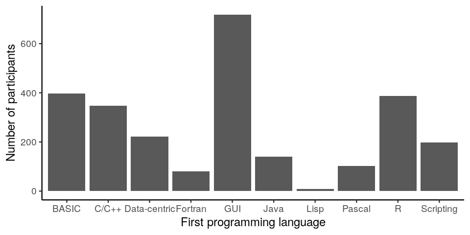
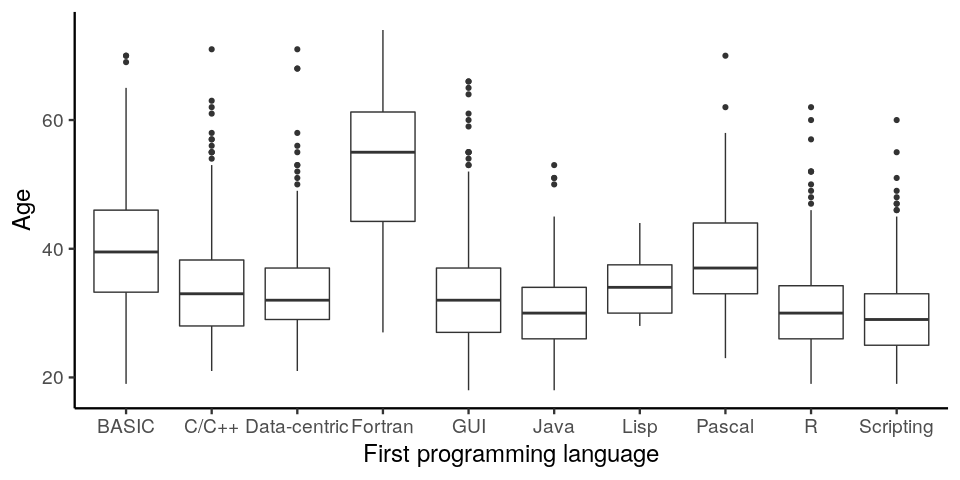
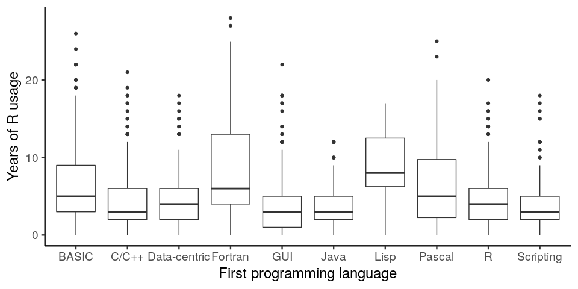
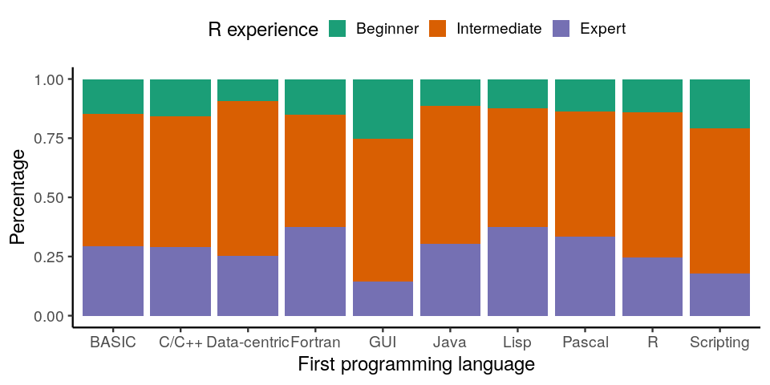
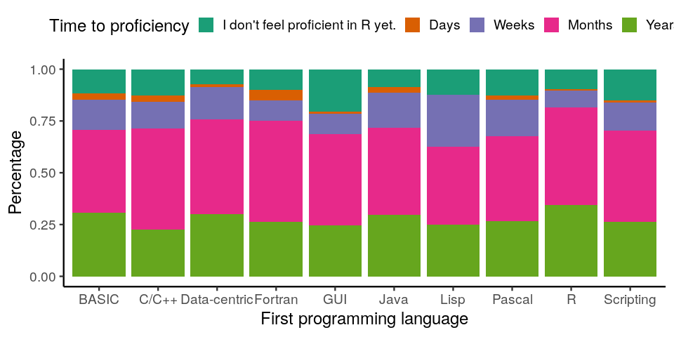
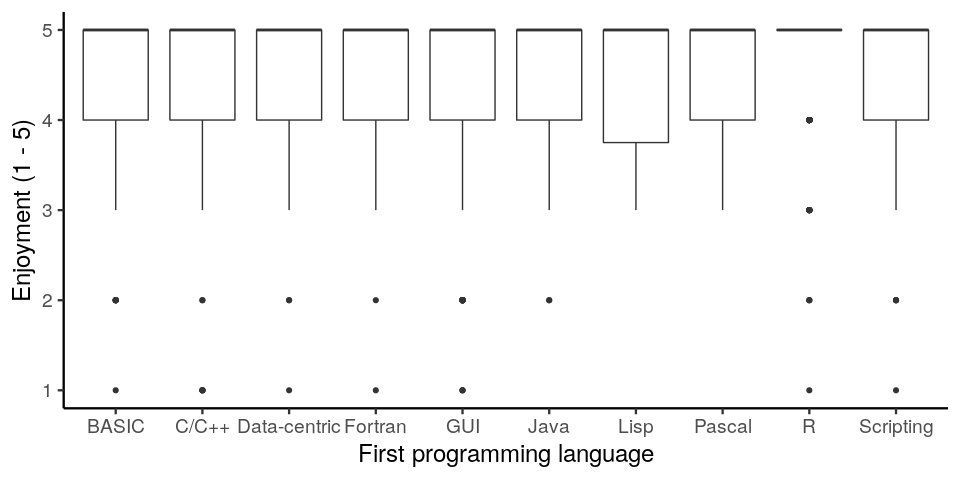
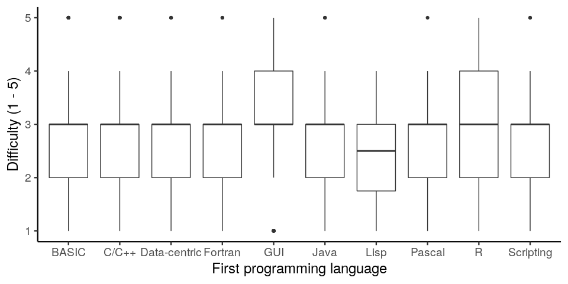
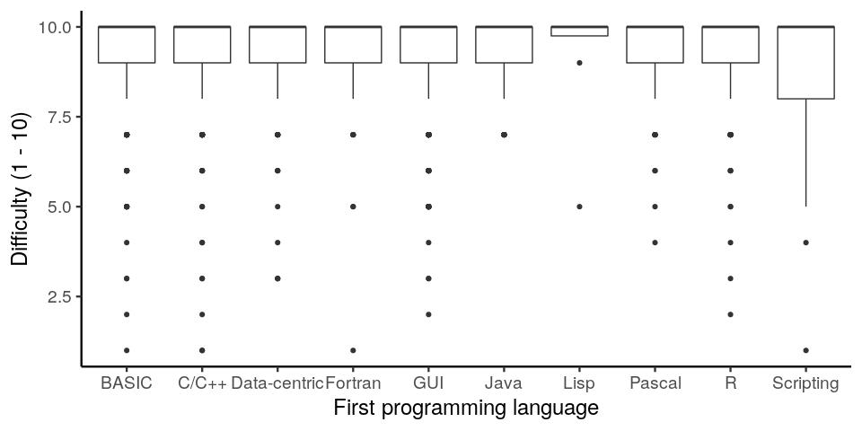

How does first programming language affect ability to learn R?
================

**Author:** John Blischak

**Date:** 2020-04-22

**License:** [CC-BY 4.0](https://creativecommons.org/licenses/by/4.0/)

The data comes from [RStudio’s 2018 survey on learning
R](https://github.com/rstudio/learning-r-survey). The raw data includes
responses from 3080 participants.

I focused on the data of [reported first language
learned](https://github.com/rstudio/learning-r-survey/blob/master/2018/dictionary/first-language-dictionary.tsv).
Specifically, I was interested to see if there was any evidence that
prior exposure to specific programming paradigms influenced the ability
to learn R. For example, since [R began as a Lisp-like interpreter
written in
C](https://www.stat.auckland.ac.nz/~ihaka/downloads/Interface98.pdf),
does experience with Lisp and/or C provide any advantage when trying to
grok R? After applying quality filters and only keeping participants
that could be assigned to a large enough group of first programming
language, I was left with 2603 participants.

**Disclaimers:**

  - I’m a geneticist. Don’t take any of this too seriously.

  - The study authors themselves warn of the incredible sampling bias.
    And as you will see from the results below, the participants are
    satisfied R users.

## First programming language

<!-- -->

## Demographics

But isn’t first programming language going to be super confounded with
age and experience? Surprisingly, not as much as I had expected.

While Fortran-first programmers tend to be older, the remaining
categories are comparable.

<!-- -->

Looking at years of R usage, Fortran-first users had more experience as
expected. But Lisp-first programmers had the highest median years of R
usage.

<!-- -->

And for self-reported R experience, the main outlier are those whose
first programming environment was a GUI (e.g. Excel, SPSS), with a
larger percentage of self-reported beginners.

<!-- -->

## Roughly how long did it take you to achieve proficiency in R?

No super clear advantage for time to
proficiency.

<!-- -->

## Please rate how much you enjoy using R on a scale of 1 to 5, where 1 is you don’t enjoy it at all, and 5 is that you enjoy it a great deal.

Everybody loves
R.

<!-- -->

## Compared with other technical topics you’ve learned in school and on the job, on a scale of 1 to 5, how difficult has it been for you to learn R?

GUI-first and R-first participants find it most difficult to learn R.
Lisp-first had the easiest time (though note they were the smallest
sample). So really learning any programming language appears to help
with learning
R.

<!-- -->

## How likely are you to recommend R to a colleague, friend, or family member?

Most participants highly recommend R. Especially the Lisp-first
participants. And the Scripting-first participants had the largest
number of lower likeliness to recommend R, but this group includes
Python, so maybe that is to be expected? :-)

<!-- -->

## Session information

    ## R version 3.6.3 (2020-02-29)
    ## Platform: x86_64-pc-linux-gnu (64-bit)
    ## Running under: Ubuntu 18.04.4 LTS
    ## 
    ## Matrix products: default
    ## BLAS:   /usr/lib/x86_64-linux-gnu/atlas/libblas.so.3.10.3
    ## LAPACK: /usr/lib/x86_64-linux-gnu/atlas/liblapack.so.3.10.3
    ## 
    ## locale:
    ##  [1] LC_CTYPE=en_US.UTF-8       LC_NUMERIC=C              
    ##  [3] LC_TIME=en_US.UTF-8        LC_COLLATE=en_US.UTF-8    
    ##  [5] LC_MONETARY=en_US.UTF-8    LC_MESSAGES=en_US.UTF-8   
    ##  [7] LC_PAPER=en_US.UTF-8       LC_NAME=C                 
    ##  [9] LC_ADDRESS=C               LC_TELEPHONE=C            
    ## [11] LC_MEASUREMENT=en_US.UTF-8 LC_IDENTIFICATION=C       
    ## 
    ## attached base packages:
    ## [1] stats     graphics  grDevices utils     datasets  methods   base     
    ## 
    ## other attached packages:
    ## [1] forcats_0.5.0   stringr_1.4.0   dplyr_0.8.5     purrr_0.3.4    
    ## [5] readr_1.3.1     tidyr_1.0.2     tibble_3.0.0    ggplot2_3.2.1  
    ## [9] tidyverse_1.3.0
    ## 
    ## loaded via a namespace (and not attached):
    ##  [1] tidyselect_1.0.0   xfun_0.13          haven_2.2.0        lattice_0.20-41   
    ##  [5] colorspace_1.4-1   vctrs_0.2.4        generics_0.0.2     htmltools_0.4.0   
    ##  [9] yaml_2.2.1         rlang_0.4.5        pillar_1.4.3       withr_2.1.2       
    ## [13] glue_1.4.0         DBI_1.1.0          RColorBrewer_1.1-2 dbplyr_1.4.3      
    ## [17] modelr_0.1.6       readxl_1.3.1       lifecycle_0.2.0    munsell_0.5.0     
    ## [21] gtable_0.3.0       cellranger_1.1.0   rvest_0.3.5        evaluate_0.14     
    ## [25] labeling_0.3       knitr_1.27         curl_4.2           fansi_0.4.1       
    ## [29] broom_0.5.5        Rcpp_1.0.4.6       backports_1.1.6    scales_1.1.0      
    ## [33] jsonlite_1.6.1     farver_2.0.1       fs_1.3.1.9000      hms_0.5.3         
    ## [37] digest_0.6.25      stringi_1.4.6      grid_3.6.3         cli_2.0.2         
    ## [41] tools_3.6.3        magrittr_1.5       lazyeval_0.2.2     crayon_1.3.4      
    ## [45] pkgconfig_2.0.3    ellipsis_0.3.0     xml2_1.3.1         reprex_0.3.0.9000 
    ## [49] lubridate_1.7.8    rstudioapi_0.11    assertthat_0.2.1   rmarkdown_2.1     
    ## [53] httr_1.4.1         R6_2.4.1           nlme_3.1-145       compiler_3.6.3
